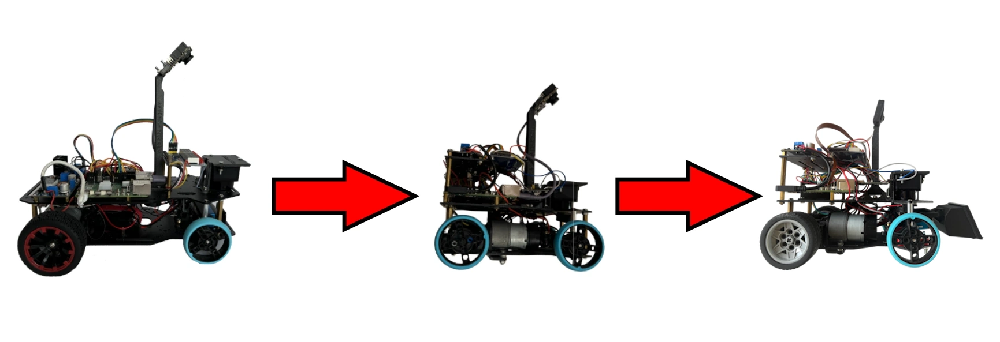

# Our Journey

The documentation will begin with the journey we went on this year, our struggles, our biggest achievements and even some funny things we had encountered.

## Our past

WRO has been quite a significant part of our lives for a few years now. While the competition had come with its fair share of hardships it also gave us some of the most important opportunities in our lives. Last year was our first time experiencing the Future Engineers category and it was a great challenge. We learned a lot and even **managed to secure the title of World Champions,** something we couldn't even dream of achieving before. After such an incredible first experience, we already realized how important this project was for us and eagerly started preparing for this season of WRO.

---

## The planning phase

In the first phase of development, we mostly did **planning and information gathering.** We already learned last year just how important it is to collect information and have concrete plan. At our first meeting we wrote down what we needed to improve over last year, which areas of our robot required more work.

This was what we came up with:

* Getting new camera with manual image processing
* Making custom made differential gear with higher efficiency, speed and less play in the wheels
* Speeding up our Lidar sensor for a higher refresh rate
* Some kind of alignment protocol to correct any deviation, probably with wall alignment
* Maximize the documentation
* Fix any lingering problems from last years and make the robot overall more reliable

After this we searched up the most successful teams from last years and assigned everyone one or two documentations from those teams to review. This was really useful for us, since a lot of teams had great and interesting ways to solve this challenge, while also **learning what was required in the documentation** from analyzing the points they had gotten.

## The development phase

The most important tasks we wanted to tackle first were the camera and the differential, since without these parts the robot couldn't even start moving.

### The camera

In the last year's design we used a Pixy Ai camera to do the color detection for us. After a lot of tinkering it worked well enough for that season, but we found the camera to be a bit colorblind, so this year **we decided to take matters into our hands.**
Finding the right camera was the easiest part. We only had a few things we required. A large enough FOV, flat/non fisheye lenses and relatively easy integration. After just a bit of searching we landed on the **Raspberry Pi Camera Module 3.**
This camera had everything we needed. A FOV of 66° horizontal and 41° vertical. Since we use a Raspberry Pi 5 as the brain of our robot and this is the official camera made for the Raspberry Pi, integration was easy as Pi(e). There was already a fully feature complete Python library made for it and the Raspberry even has a dedicated camera port.
After this, we moved on to making the camera actually work. Making simple pictures was quite an easy task, but then it got a lot harder. First we had to test out the perfect height and angle the camera would need to be in order to get the right image.

This took quite a few tries but we found a 15° depression angle at a height of around 20 cm to be sufficient for our needs. These measurements allowed us to make a 3D printed camera stand that would hold the camera in the right place. Then came the logic of the camera.
Our idea was to use the measurements from our **Lidar sensor to pinpoint the location of the obstacle** on the camera and then take the average of all the pixels inside that area thus getting a value of how green and how red it is. This is why it was important that we used a flat lense, since this way we didn't have to account for camera distortion and could avoid using matrix equations, allowing us to use simple geometry for our solution. But even with this, there were problems we had to solve. For example only after a few weeks did we realize that the camera **wasn't using its maximum FOV,** which was crucial for our calculations. Other than this we also had to be mindful about any modifications we made since then we had to update the camera's height and angle in the code. After a lot of fiddling and optimizing, **it worked beautifully.** While still not perfect it was already miles ahead in reliability compared to the Pixy cam.

### The differential

The differential was also a big part of last year's project and it managed to sneak its way into this year's as well. While the Lego differential we used before worked fine, it wasn't the most secure thing in the world. The wheels had a lot of play and the transmission was far from ideal. The motor we used was quite powerful with more than enough torque than we would ever need so we could afford to lose some. Thus **we decided on making a custom differential** with a 1:1 transmission rate, a lot tighter tolerances and imbedded bearings to decrease friction and make things more secure.
Making a differential is a lot harder than just slapping some cogs together, It requires a lot of data and calculations. So first we needed to make an accurate mechatronic model of our system and use it to design the 3D models. The modelling wasn't an easy task either, since **all the components had to fit together perfectly** and we wanted to use the fiberglass lego axles from last year requiring it to be compatible with Lego, while also having a D shaft as an input. 
After printing out the models we made, sanding out things where needed and doing some assembly everything seemed to work great. This was a great addition to our robot, since it made everything more precise and allowed us to reach even faster speeds, providing an increase of about 1.4 times and the asymmetric design of the gears made it a lot more efficient.

### The new motor

While the new differential already provided us with a decent speed bump, **we wanted more.** We managed to get maximum points last year but our time was rather lacking compared to the other teams earning maximum points, so we knew we had to improve more. To further increase the speed of our robot we decided to get a new motor of the same kind we used before but with a better built in transmission. This change lowered our torque even further, but with the staggering 3 times speed boost it provided, we decided to take the trade. With change our maximum speed had reached **over 4.5 times what we had the previous year.**

### Parking

The parking was one of the main rule changes compared to last year. While the increased parking space was really useful, parallel parking still proved to be a lot more difficult than perpendicular parking. We first tried a method of basically wiggling our way out of the parking space, but that added a lot more complexity and was influenced too much by the play in the motor and wheels. To fix this we had to **heavily modify our steering gear,** by moving up the servo and extending its range to the absolute limit. These changes allowed the robot to simple drive out of the parking space with one turn.

### Speeding up the Lidar

The refresh rate of our Lidar was already a problem last year and since the speed of our robot has increased even further this problem did as well. The problem stems from the fact that the Lidar only spins 10 times a second, meaning that a given degree only refreshes every 0.1 seconds, so if the robot were to move at a speed of 1.5 m/s then **the robot could move 15 cm between two measurements,** making the run a lot more instable. With some trial and error we managed to get it up **from 10 to 15 Hz** which is still quite slow, but a decent enough improvement.

### Wall alignment

We also needed some way to further stabilize the run. An issue that came up sometimes was that the gyro could slowly shift causing the robot deviate from how far we wanted it to be from the wall. We fixed it by adding a little correction arcing each time we went in a straight line. The arc was just small enough that it **could do it without moving the Lidar.** This change made the robot a lot more predictable and reliable.

### Predictive gyro

Just like Lidar, we had issues with the refresh rate of the gyro as well, but with turning. However we could use a more robust solution this time, since the gyro on outputs one value and that value cannot have big jumps in it. We decided on using an interpolation method, basically **predicting the gyro values based on previous data,** allowing us to end turns at just the right time.

### Custom interconnect PCB

In order to save some space and ensure proper
wiring, we designed a custom PCB in [KiCad](https://www.kicad.org/). The PCB is designed to
house the ESP, and to properly group the various output pins
we need to connect to the other parts of the system according to the following schematic:

Two mounting holes were added to allow us to affix the PCB using 2 M3 screws. In order to save some space, we also added a few redundant pins to the `GYRO1` element. This let us put the IMU right on the top of the PCB.

As a safety precaution and to ensure extensibility, all ESP pins were mirrored to their respective sides. This proved essential, because we failed to notice a critical mistake before ordering the PCB. ENC1 and ENC2 were 1 pin higher (below the +3V3 label), meaning that instead of ENC1 being connected to a programmable GPIO pin, it connected to the EN pin. This meant that, whenever the pin got any power, the enable pin triggered a reset in the ESP. While we lacked the time to order a new PCB before the competition, we could use a jumper connected to one of the pin mirrors to amend this issue. As for the files themselves, all PCB design documents contain a version where this wiring mistake has been fixed.

After all wiring has been laid out, the final PCB layout is as follows:

*Note: the red wires are on the top, the blue ones are on the bottom of the PCB, which let us connect everything in a clear, simple matrix layout without collisions*

Some extra rules had to be employed in order to ensure the PCB working properly. First, the GND and +3V3 as well as +5V wires were thickened, since they deliver much more current than everything else. Another big factor was the 5V wiring itself: the ESP could either get its 5 volt power through the built in pin or USB-C port, but not both without that causing issues (for example, it managed to break the USB port of one of our ESP-s). Because of this, a jumper bridge has been added, if the `ESP32 5V SWITCH` pins are not connected, the ESP must be supplied through the USB port, otherwise power delivery is done through the dedicated pin.

This was the final PCB design:

After every factor mentioned above has been dealt with, a BOM assembled, and the PCB ordered, the PCB was successfully integrated into the car (besides the EN miswiring mentioned above).

The PCB project itself, as well as the BOM we used to order the final pcb can be found in the 
[schemes/wro_nyak](/schemes/wro-nyak/) subfolder.

### Troubleshooting

In the development process we also encountered some rather peculiar and informative issues. Those are listed below:

* We noticed some issues with the Lidar. First of all we noticed seemingly random 0 values appearing in our logs, that disappeared for some reason when wo covered the robot with a box. Turns out when the light from the Lidar bounces away into world and does not return or goes further than 12 meters, the Lidar will say the distance was 0. Thankfully we could ignore those values. Another problem was the dead zone of the Lidar changing, but we could solve that by implementing dead zone management into our code.

* A problem with our motor also arose, when it started moving in an uneven throbbing fashion, that disappeared when we stopped controlling it. This was most likely caused by electromagnetic interference from one of the cables near the motor. After moving the cables, the problem disappeared.

* After the speed increase the tires of the robot started sliding a bit when braking and starting. This was easily fixed by replacing the back tires with ones that have more grip.

* When replacing the motor, we didn't account for the fact that it had a slightly shorter shaft, which later caused the cog to slip off from it. Fortunately the fix was just making the back of the cog a bit longer. 

### Aesthetic changes

When working on the robot we realized a grave mistake we had made last year. **We did not give a name to our robot,** so we needed to change that as soon as possible. Since during testing our robot had a tendency tu bulldoze over things, we decided on naming it Dózer, from the world bulldózer, which just means bulldozer. After coming up with the name we also wanted it to look the part, so we gave it a little shovel upfront and a license plate on the back.

---

## Teamwork

We usually **met up once a week to work on this project,** but even when we weren't together we would work on it. We kept a log of all the times we worked on something. Everyone had a part of this project that they were the most familiar with, and so when we were not together we would usually work on those parts and then share our code snippets and unfinished or work in progress documentation via a private GitHub, finally publishing it on the official one. Any chance we got we would talk or text about what to do, what we should focus on, frequent communication was a key part of our work. We needed to have a clear goal every time in order to not get sidetracked and waste our time on the unimportant things. Every week when we met up, first we merged everything we did separately together and then did the things that all of us were needed for. This way even though we only met up once a week, **we could have a constant flow of progress.** It's important that even though every member of our team had an area of the project they were most familiar with, we still strived to introduce each other ot our own areas, so that everyone is familiar with the whole project as a whole. We believe this is necessary for efficient teamwork.

## The future

We made huge improvements over last year, making the robot a lot faster and more reliable, however there are still some things that could be improved upon:

* Getting a faster servo, to make turning even more accurate.
* Optimizing the size of the robot.
* Changing the motor controller to a more modern one with higher efficiency.
* Optimizing our strategy and developer tools even further.

## Conclusion

Overall we are **incredibly happy with how our robot turned out** and glad we took upon this challenge and went on this journey together. We could successfully do all the things we had planned and even made some funny memories in the process. The process was hard, but worth it in the end and we hope to continue working on it in the future.
