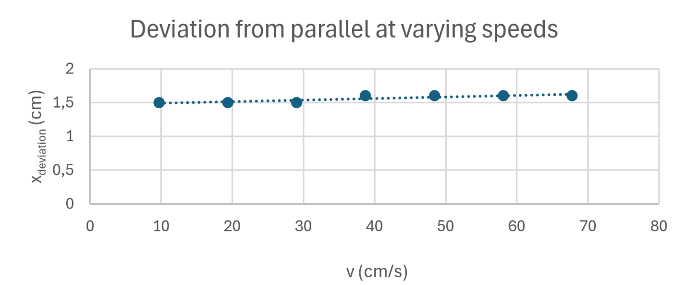
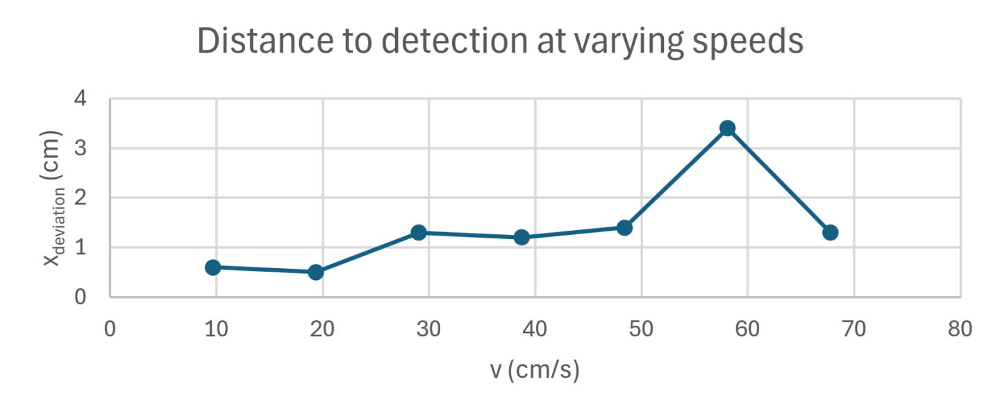
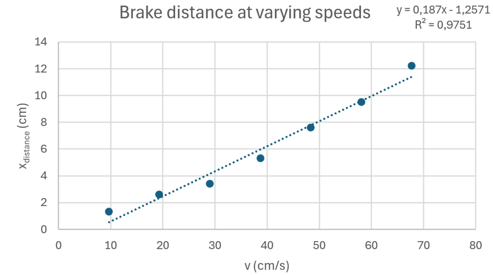
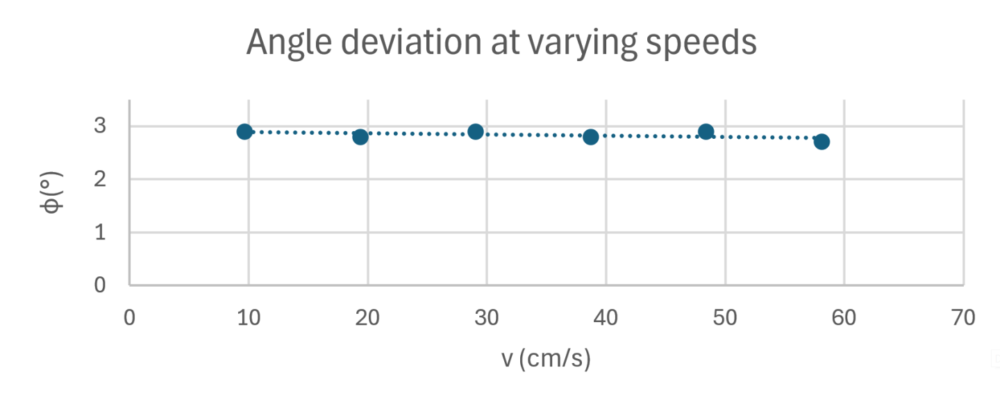

# The robot's mechanical characteristics

In this section we will write about different kinds of tests we had our robot do in order to **gather data about its precision.** These data allowed us to draw conclusions that could help us calibrate our runs and **fix any instability issues that might occur.**

## Deviation from parallel at varying speeds

In this test we had our robot go in a parallel line and then measure how **much it deviated perpendicularly to the parallel.**
In each measurement we used a **different speed, but the same distance,** since the deviation is proportional to the distance when going straight in a smooth movement. At first glance the speeds we used seem random however this is due to the fact that **our robot measures velocity in internal encoder "tick"/second rather than meter/second,** so we had to convert it using the diameter of the wheels, the ratio of the motor and the differential gearbox, and the resolution of the encoder to finally get cm/s. (12.4 t/s = 1 cm/s)

|   | v(cm/s)   | xdeviation (cm)|
| - | --------- | ------------------------- |
| 1 | 9.682417  | 1.5                       |
| 2 | 19.36483  | 1.5                       |
| 3 | 29.04725  | 1.5                       |
| 4 | 38.72967  | 1.6                       |
| 5 | 48.41208  | 1.6                       |
| 6 | 58.0945   | 1.6                       |
| 7 | 67.77692  | 1.6                       |

The conclusion we can draw from this is that the **change in deviation from the speed is negligible** enough, so that we can use any speed we desire, but there is still a constant amount of base deviation, that thankfully can be fixed by adding a **constant multiplier** in the code.

## Distance detection at varying speeds

For this test we had our robot go in a straight line until it got in a 50 cm distance of the object in front of it. The purpose of this test is to **measure the latency of our lidar sensor,** which can be concluded from the extra distance the robot goes before realizing it is in the 50 cm range.

|   | v(cm/s)   | xdeviation (cm)|
| - | --------- | ------------------------- |
| 1 | 9.682417  | 0.6                       |
| 2 | 19.36483  | 0.5                       |
| 3 | 29.04725  | 1.3                       |
| 4 | 38.72967  | 1.2                       |
| 5 | 48.41208  | 1.4                       |
| 6 | 58.0945   | 3.4                       |
| 7 | 67.77692  | 1.3                       |

This data at first seems to be chaotic but after thinking about it there is a very reasonable explanation for this behavior. The lidar sensor spins around 10 times per second. This means that when the robot goes with, for example 48 cm/s, in one revolution or between two measurements, it could go 4.8 cms, **so it depends on both the speed and the lidar's current position.** Thankfully this deviation does not add up, because we are getting a new measurement at every turn. For the obstacle challenge we are going slowly most of the time **immensely reducing the maximum amount of deviation** we could get. We concluded that to speed up to open challange we will have to also speed up the LiDAR, which was possible, up to 15 times a second. This did present other challenges, which are detailed in the [software documentation](/src/README.md#sensors-and-motors).

## Brake distance at varying speeds

In the previous test after the robot sensed that it is in range it started breaking and each time **we measured the break distance.** Being able to calculate brake distances can be crucial if we want to make **precise movements.** 

|   | v(cm/s)   | xdeviation (cm)|
| - | --------- | ------------------------- |
| 1 | 9.682417  | 1.3                       |
| 2 | 19.36483  | 2.6                       |
| 3 | 29.04725  | 3.4                       |
| 4 | 38.72967  | 5.3                       |
| 5 | 48.41208  | 7.6                       |
| 6 | 58.0945   | 9.5                       |
| 7 | 67.77692  | 12.2                      |

As we can see from the diagram **the correlation between the brake distance and velocity is basically linear,** which massively simplifies the process of calculating.

## Angle deviation at varying speeds

The last test we did was check much the robot would say it actually turned when we tell it to turn 90 degrees at different speeds. The amount we give it shouldn't really matter since we are not testing the gyro's accuracy, we are testing how well it can turn according to what the gyro tells it, so this is how well the **internal turning control** algorithm works, not how accurate the **gyro** is.

|   | v(m/s)   | φ(°) |
| - | -------- | ---- |
| 1 | 9,682417 | 2,9  |
| 2 | 19,36483 | 2,8  |
| 3 | 29,04725 | 2,9  |
| 4 | 38,72967 | 2,8  |
| 5 | 48,41208 | 2,9  |
| 6 | 58,0945  | 2,7  |

Same as with the parallels, the speed of the robot does not seem to determine the deviation, since **it is practically a constant number,** making it something that can easily be **corrected by adding a constant** to the calculations in the code. We concluded that his constant is releated to the turning speed of the servo. Since the servo isn't instantenious, when we reach the target angle the robot will continue turning for a bit until the servo straightens. We combatted this the introduction of `predictedYaw` which calculates at what angle the robot will be in the future, exactly by how many seconds the servo takes to straighten, so the robot can stop turning then.

# Conclusion

In conclusion these measurements **massively helped us** when optimizing for the run, since it showed some critical inaccuracies, which if left unchecked **could have cause some serious problems** in our runs. It also helped us to understand our robot's capabilities and limits just a little better.
