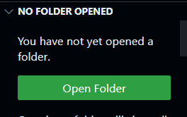
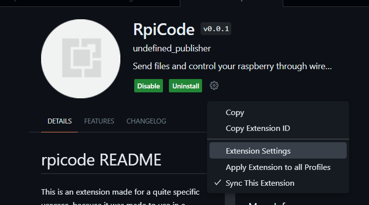
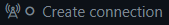
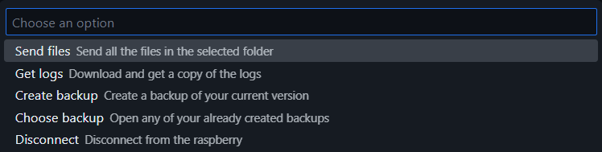
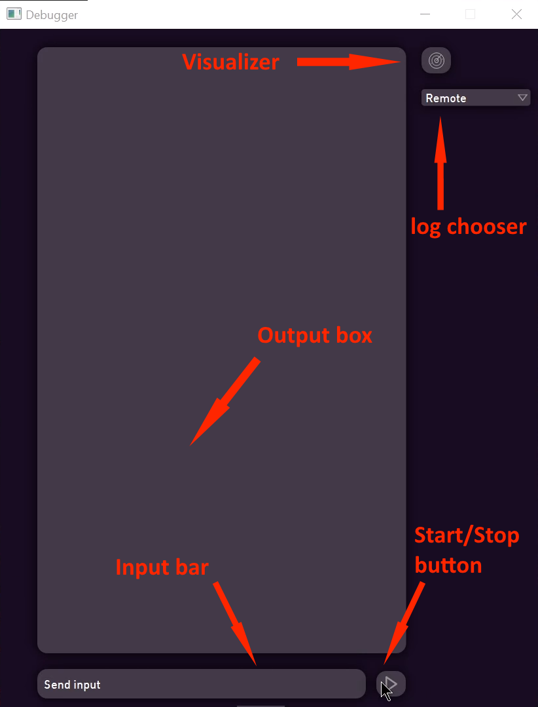
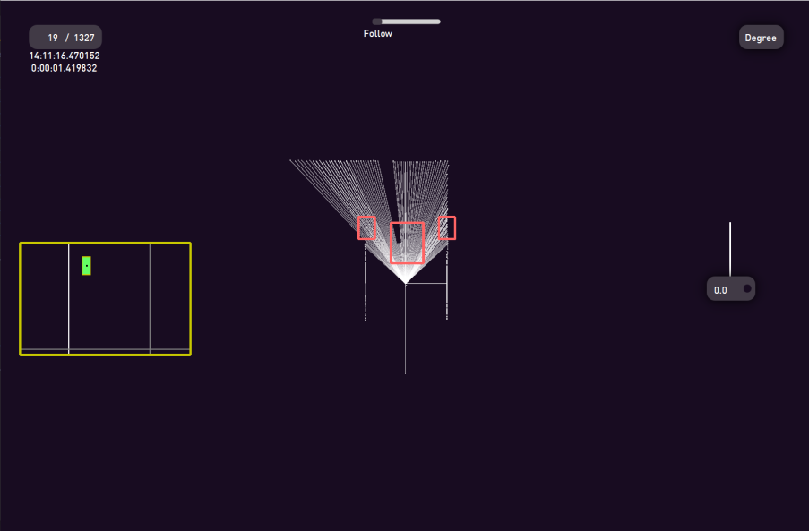
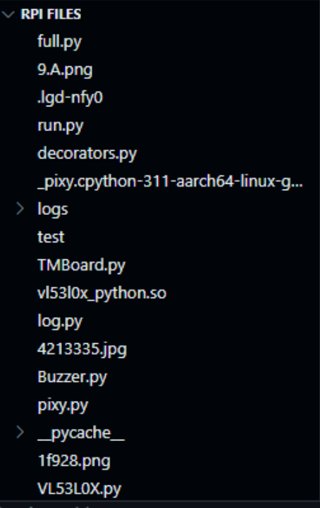

# RpiCode installation and features guide

In this guide I will talk about our VSCode extension RpiCode, how to install it, set it up, and what kind of features it provides. **This extension is still heavily work in progress,** however the feature it does already have are in a usable enough state to use it daily.

RpiCode is both a development tool as a file manager and remote program runner for the Raspberry Pi, and a sensor-data visualizer which combines the LiDAR data with the IMU angle and the camera data alongside a log message replay. Producing a nice and useful visualization of the entire robot run, live, or from the downloaded logs, while being integrated into VScode in the form of an extension. The logs are created by our custom sensor & messages logging library which we have integrated into the robot run's code.

---

## Installation

### Installing the extension

**Download the `rpicode.vsix` and then open vscode.** In vscode select a workspace folder by clicking on the explorer icon on the left and clicking open folder.

**Make sure that the file is in that folder.**
After that make a new terminal by clicking the three dots on the top next to `Go` , selecting `Terminal`, then `New Terminal`. In the terminal type the following command:

> code --install-extension rpicode.vsix

In case you change the downloaded files name, **change rpicode in the command to the new filename.**

### Installing the required python libraries

In this step I'm going to assume that python and pip have already been downloaded, **however if not, then visit our software [installation guide](/src/)**.

In the terminal type the following commands:
> pip install PyQt6

 Installs PyQt6 graphical interface library

> pip install Paramiko

 Installs Paramiko ssh library

> pip install websockets
 
 Install websockets websocket library

## Setting up the extension

After the installation is done, go into the extension tab on the left, then select rpicode, find the cogwheel and click extension settings. **There you can find all the settings with descriptions**. I should add however that the ip section doesn't necessarily need to be filled out, since by default it uses `raspberrypi` instead which works, most of the time. **Will probably not work and the ip will be needed if multiple raspberry devices are on the same network.**
If everything is done correctly then the extension should start on startup.

---

## Features

- ### The Terminal
  After successfully starting the extension a button called `Create connection`  should appear **on the status bar at the bottom right.** Before pressing it make sure once again that the **settings are filled out correctly and you're on the same internet connection as your device,** but an ethernet can be used as well. After pressing it a new terminal by the name of `run` is created. Wait a bit until you you see the following text: `cc>`. The terminal has 3 modes:
  - Custom command:
    It is the default mode, but can be accessed anytime by typing `cc`. It only has a few **commands which can be checked by typing `help`.** (The command `diagno` does nothing at the moment)
  - ssh:
    This mode can be chosen by typing `ssh`. It is just an ssh terminal, **so anything typed in will be sent to the remote device as a terminal command,** like the command `whoami` will give you the username of the Raspberry Pi.
  - cmd:
    Obviously the command to access this is `cmd`. This is just a **regular local cmd terminal,** nothing special.

- ### Sending all files
  After making the connection, the `Create connection` button changes to `Connected features`. Pressing it will make a little menu appear on top. The button, called `Send files` **will send over all files and subdirectories in the `Folder Path` folder to the `Send Folder Path` folder on the remote device** (This is basically just a shortcut to writing `send_all` into the cc terminal).

- #### Backup files
  The third button, `Create backup` will first ask for a name then a description, **after which it will create a new folder in the `Backup Folder`** with the files in the `Folder Path`. There is also a `Choose backup button`, **however at this moment it does not do anything** except showing all the backups already made.

- ### The debugger
  **This is the biggest feature in the entire extension.** After connecting a little start button will appear next to the `Connected features` button. After clicking on it, the debugger window will appear.
    - #### Running the program
      In the debugger at the bottom right there is a start button, after pressing it, the program on the robot will start. **Immediately anything printed by the robot using our log module will appear on the big box at the center.** The messages will be colored according to their logging level.
      - debug - blue
      - info - white
      - warning - orange
      - error - red
      - critical - dark red 
        (**critical is only used when an exception occurs** and the debugger will notice it and changes back the stop button, to a start one)
      
       Below the box there is a `Send input` box. **Anything written inside will be sent over as an input to the program.**

      

    - #### The visualizer
      
      **On the right of the window there is a button with a radar icon.** If pressed while the program on the robot is running, another window called visualizer will open. Inside it, a lot of information can be seen. **In the middle you can see the lidar map, it is a map of the distances the lidar has given.** The dots are the individual distances, the lines are the degrees we ask for inside the code, and the rectangles are the areas where we search for objects.

      On the top right there is a box labeled *Degree*. By clicking on it and typing in a degree, the degree will be highlighted with yellow and the text will be replaced with **how far away that point is in real life centimeters.** It will constantly refresh, and you can always change it to a different degree.

      By clicking at two different points a red line can be drawn between them with a number telling us **how long the line would be in real life, allowing us to make accurate measurements.**
      By pressing the delete key, both the drawn line and the degree line can be removed. (These two features are most useful in playback mode, more on that later)

      **On the left, there is a yellow rectangle, inside which is what our Pixy camera sees.** The lines there are cutoff lines, they are where we cut off a part of the image to filter out possible abnormalities. Other than that it is quite straightforward.

      The visualizer has three viewing modes that can be changed with the slider on top:
        - Follow
          - The standard viewing mode. **The dots follow the orientation of the robot.**
          On the right there is a solid white line and a little box. **Inside the little box we have our gyro orientation value and the line is always perpendicular the to wall in front.**
        - Absolute
          - **The dots' orientation are set to the wall in front,** and now the line follows the robot's direction.
        - Lock
          - **The orientation stays the same the whole time, just like how it was in the starting position.**
          The line follows the robot's direction.
      
      

    - #### Getting the logs and using backup logs
      If the program is not running when the visualizer is opened, **it will use the last log on the device,** to view it. It will put it into the first position and can move back and forth with the left and right arrow keys, so the entire run can be reviewed and examined. Now inside the visualizer on the top left there is a box which shows how many states are saved and on which it is currently on. **By pressing on the current number you can change it and instantly jump to any number. Under the box is the time.**
      While playing back the run, **every logged message will also reappear in the main window according to when it was initially printed.**

      Under the the radar button in the main window there is a selection box. By default it has ony two states. `Remote` and  `Local`. **Remote plays back the last run on the robot, and local plays back the last downloaded run on the computer.**
      Additional options can be added by in VSCode inside the connected features, pressing `Get logs`. This replaces the current logs inside `Folder Path/logs` and puts a new set of logs into the folder named `backup_logs` which is inside the parent directory of `Folder Path`. Inside the `backup_logs` they appear in a new folder called `logs_month_date_hour_minute` according to when it was downloaded. **This folder will appear as a new option next to `Remote` and `Local` in the selection box.**

- ### The file handler
  This is the newest addition to our extension. **It is still work in progress and other thing will be added to it in the future.** When connected to the robot a new treeview will appear in the explorer named `RPi files`. It will show the files and subdirectories inside the `Send Folder Path` folder on the raspberry. By clicking on any of the files vscode will open that file in an editor and when **saved, will overwrite the file on the remote device.** Also when right clicking on a folder an option shows up to upload a file. Pressing it lets you choose a file on your computer and **upload it to that folder on the remote device.** If you right click on a file however the option is to download that file. This time you will need to choose a folder on your local device, where **the file will be downloaded.**For now this is all it can do, but there are a lot of things already planned.

  

- ### Our logging system
  
  **Our logging system is what makes our debugger be able to work.** It was first written with python's built in logging module, however there problems with it not logging everything, therefore we rewrote it using base python, solving all of our problems. It is a file called [log.py](/src/RaspberryPi/log.py) that is uploaded to the robot next to our running file and is used as a module to log things. **It uses five files:**
    - critical.stormslog
      This **stores any error and exception** that occurs during our run.
    - log.stormslog
      We store everything we manually print out inside this.
      Before every message there is a "indentifier" like this: 
      **< logging level - section in which the robot was in - the time of the log >**
    - lidar.stormslog
      In this, every line is a dictionary, where **we store the lidar measurements, degrees of interests, rectangles, time, gyro value and camera data.**
    - log.stormslogtemp
      **Temporary log file,** which is used by the debugger during the run.
    - lidar.stormslogtemp
     **Temporary lidar file,** which is used by the debugger during the run.
  
  > Note: The file extensions *stormslog* and *stormslogtemp* were only used for aesthetic purposes. They are the same as plain *txt* files.

- ### Offline mode
 
  **Even if for some reason the robot is not available, the extension can still be used.** After pressing `Create Connection` a bit more time will pass, since the extension will still try to connect, but when it can't **it will start in offline mode.** Offline mode offers every feature that does not require `SSH` or `SFTP`. **The debugger will also work,** except there will be no start button, send input bar nor `Remote` option.

---

## Technical information
   
  **The communication with the robot was done using `SSH` and `SFTP` protocols,** while the communication between the different python and typescript programs that the extension used was done using a local websocket server.

---

## Conclusion

Making this extension was a surprisingly big part of this project, which took a considerable amount of hours to make, **but in return helped us during the testing phase of the robot tremendously.**