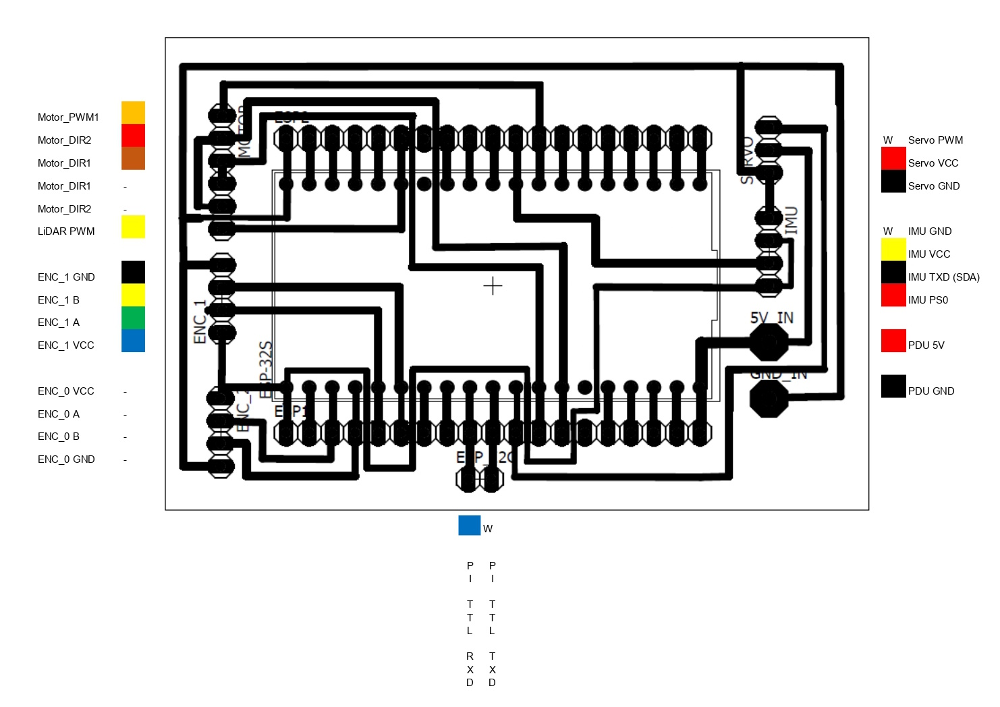
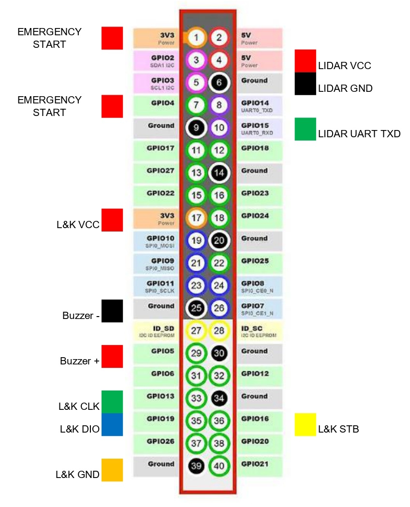
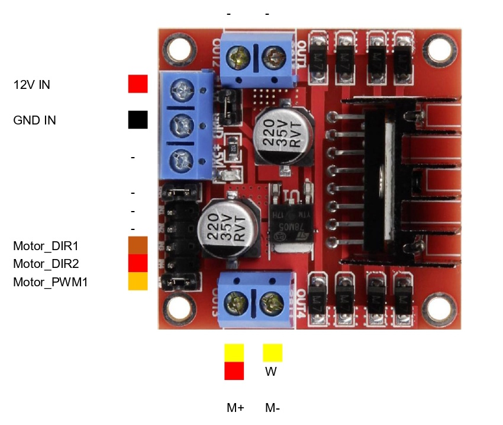
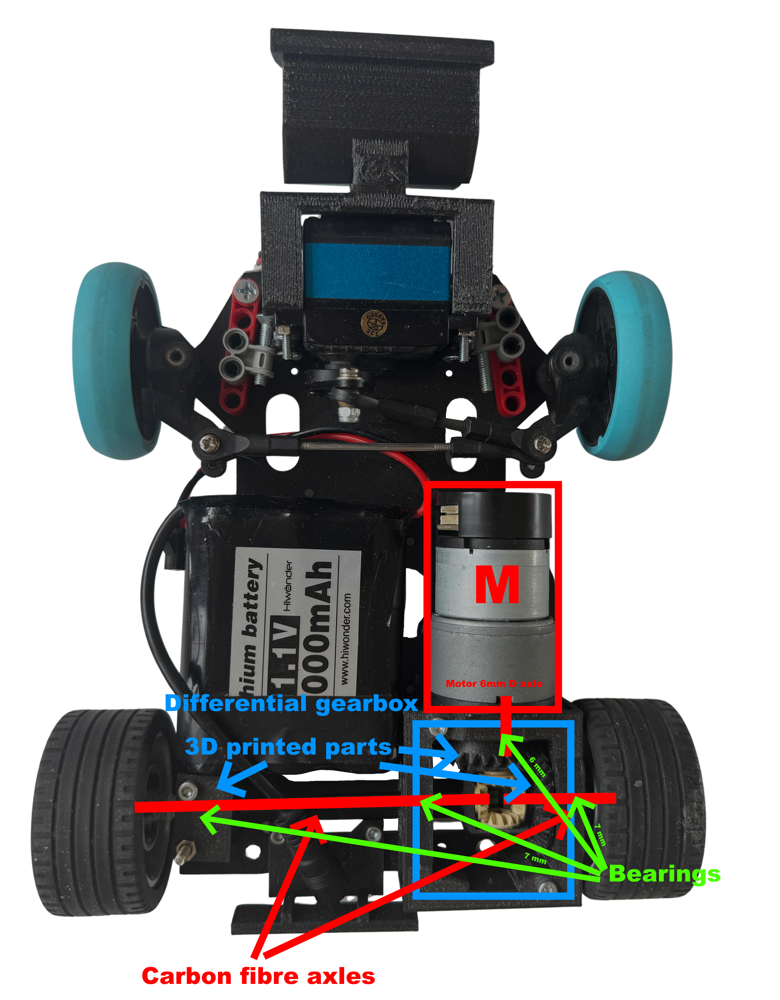

# Hardware documentation and setup guide
The robot is made up of a lot of different sensors, motors and two processing units, the ESP microcontroller and a Raspberry Pi. The car uses ackermann steering geometry and one DC motor through a motor controller with a differential gearbox we designed and printed from scratch. We had to create a lot of custom 3D printed components and even a custom interconnect panel to help with complicated wiring. The power to the robot is supplied by a 11.1V lithium battery and is later converted to 5V by a step-down module.

## List of components
We installed a lot of sensors and other components on the car, here is a list of each of them with a link and some additional notes:
- **Ackermann steering mechanism** and **base plates** [Ackermann Intelligent Car](https://www.hiwonder.com/collections/robotic-car/products/ackermann-steering-chassis?variant=40382428381271)
  - originally 270 x 197 mm, 960 g
- **Steering servo** [Carson CS-3](https://www.amazon.co.uk/Carson-500502015-500502015-CS-3-Servo-3Kg-JR/dp/B0037Y93CW)
  - Operating voltage 4.8 - 6 V, torque 31 Ncm, operating time 0.17 sec/60° dimensions : 38.5 x 19 x 32 mm, weight: 39 g
- **DC motor** [Hiwonder JGB37-520R30-12](https://www.hiwonder.com/products/hall-encoder-dc-geared-motor)
  -  Operating voltage 12V, torque 15 kg*cm max 3.2A, 280 RPM, 440 pulse-per-revolution encoder
- **Single Board Computer** [Raspberry Pi 5 4GB](https://www.raspberrypi.com/products/raspberry-pi-5/?variant=raspberry-pi-5-4gb)
  - Operating voltage 5V/5A USB-C, 4 USB ports, 40 pins
- **Microcontroller (ESP)** [NodeMCU-32S](https://www.hestore.hu/prod_10037961.html)
  - Operating voltage 5V, 2*19 pins, dimensions: 49.5 x 26 mm
- **Custom interconnect board**
  - ESP pins insert into this, PCB that groups common pins near each other, helps with wiring
- Inertial Measurement Unit (**IMU**) [BNO085](https://www.hestore.hu/prod_10044901.html)
  - Operating voltage 3.3V, drift 0.5°/min, dynamic rotation error 4.5°
- **Motor driver** [L298N-MOD](https://www.hestore.hu/prod_10036621.html)
  - Output 2*5A max
- **Step-down module** [XL4015-3D-STDN-PSU](https://www.hestore.hu/prod_10042112.html)
  - Output 5V/5A, displays voltage, useful for checking battery state
- **Battery**
  - Bundled with Ackermann Intelligent Car, 11.1V, 6000mAh, lithium
- **Display and buttons panel** [Led&Key](https://www.hestore.hu/prod_10042203.html)
  - 8 seven segment displays, buttons, LEDs
- **Active buzzer** [Z2 buzzer (KPI-G2330E)](https://www.hestore.hu/prod_10029469.html)
  - Operating voltage 3-24V DC, 3700 Hz, 83 dB, dimensions ⌀23x10mm
- **Power switch** [ST 1/BK (MRS-1)](https://www.hestore.hu/prod_10023322.html)
  - Dimensions 19.3x12.9mm
- **LiDAR sensor** [STL-19P, D500 development kit](https://www.waveshare.com/wiki/D500_LiDAR_Kit)
  - Dimensions 38.6 x 38.6 x 34.8 mm, range 0.02-12 m, frequency 5-15 Hz, accuracy ±45 mm
- **Camera** [Raspberry Pi Camera Module 3](https://www.raspberrypi.com/products/camera-module-3/)
  - FPC connector, standard lens, RAW10 color format, vertical FOV up to 41°, horizontal up to 66°
- **Ball bearings**
  - 3 pieces of 7(inner diameter)x19x6 mm and 1 piece of 6(inner diameter)x12x4 mm
- **USB-TTL bridge** [CH341T-V3-M](https://www.hestore.hu/prod_10044421.html)
  - supports both 3.3V and 5V, enables us to use another serial port on the Pi for UART communication
- [**Carbon fiber Lego technic axle**](https://joooooy.com/products/moc-carbon-fiber-technic-axle-4519-3705-32073-3706)
  - can be cut to size, heavy-duty, won't bend as easily
## Assembly - Overview

This section serves as an overview of the design philosophy of the robot. For more details about the actual driving and steering mechanism see [Drive](#drive), and for building instructions see [Building instructions](#building-instructions).

Our robot utilizes ackermann steering geometry and differential drive. We have 3 decks, a bottom deck (or lower deck) for the servo, driving mechanism and the power supply. On the middle deck we have the Raspberry Pi, the main control unit coded in python, responsible for the main challenge logic, and the ESP microcontroller, the secondary control unit coded in C, responsible for receiving sensor data and controlling the motors. The LiDAR sensor is is also mounted here. The third deck is about half the size of the other decks, it houses things like the motor driver, the IMU, the display panel and the step-down PSU.
 
(Sketch that illustrates the connections between the different components of the robot)

For steering we used a solution that can be found in many RC cars, we took one from the Ackermann Intelligent Car by HiWonder. After calibrating the geometry to the length of our car we maximalized the steering range to ensure tight turns. We also replaced the steering servo for one with less power consumption and slightly smaller size. For the driving motor we used a 1:10 ratio 12V DC motor and secured it with 90° mounting brackets. The D-shaft of the motor goes inside the custom-designed differential gearbox, where we convert to a lego technic X axle, on which the wheels are mounted. For the rear wheels we used wider Lego wheels to minimize slippage. The front wheels are slimmer so the front of the robot can be thinner which is ideal when dodging obstacles or parking. Due to the many heavy installments, such as the motor and the power supply, the center of gravity is low, which is ideal for track stability and turning.  On the middle deck we have the Raspberry Pi and the ESP-32 microcontroller with its pins mounted on a custom interconnect-board which we made with the help of a professional. It helps with the wiring by routing certain pins next to each other and allowing us to use ribbon cables, making everything much cleaner. This deck is separated from heavy-duty equipment like the motor which cause electrical noise that could interfere with the controllers. The LiDAR sensor is also mounted here with a special mounting bracket, ensuring the widest FOV possible. The base of the camera tower is also mounted here. The third deck is much smaller, the main reason we installed it was the lack of space for the remaining components, while also keeping the car small and light. Importantly the Led&Key input and display panel is also installed here for easy access. The camera tower ensures the camera is looking in front of the robot with a 10° vertical tilt down. The final size of the robot is 26.8 cm long, 17.9 cm wide and 20.9 cm high. It weighs 1246 grams.

## Wiring diagrams
The colored squares represent the cable colors on the robot.
### ESP microcontroller (NodeMCU) pinout with connections labeled:
This illustration is most important for the source code, since everything is actually wired through the custom-made board for the ESP.

(ENC-Motor encoder, PI-Raspberry Pi)
### Custom-made interconnect panel wiring with connections labeled:

(ENC-Motor encoder)

A CAD model is also available in the [ESP_v8.sch](ESP_v8.sch) file.
### Raspberry Pi pinout with connections labeled:

(L&K-Led and Key panel)
### Motor controller wiring:

All of these can also be found in the form of an excel spreadsheet in the [pinouts.xlsx](pinouts.xlsx) document.
## Power
A simple explanation of the power supply hierarchy of our robot.
- Battery `12V`
  - Step-down module `12V-->5V`
    - Steering servo `5V`
    - Raspberry Pi 5 `5V` (from USB-C, can supply `3.3V`)
      - LiDAR `5V`, **180mA**
      - Camera `5V` **200mA** (FPC)
      - Led&Key Panel `3.3V`
    - NodeMCU-32S `5V` (from Vin pin, can supply `3.3V`)
      - Inertial Measurement Unit `3.3V`
      - Motor encoder `3.3V`
  - Motor driver `12V`
    - DC motor `12V` **~1A**

## Connections
The different connections used between the components of the robot and their hierarchy:
- Computer
  - Raspberry Pi `SSH`
    - ESP `UART` Pi: **USB-TTL** - ESP: **RXD-GPIO-25, TXD-GPIO-26**
      - IMU `UART-RVC` **(SDA-GPIO 17)**
      - Motor encoder `Digital` **(A-GPIO 34, B-GPIO 35)**
      - Motor driver `PWM` 2x`Digital` **(ENA-GPIO 12, ENB-GPIO 14, PWM-GPIO 21)**
      - Servo `PWM` **(Signal-GPIO 27)**
    - LiDAR `UART` **(TX-GPIO 15)** 
    - Led&Key panel `Data, Strobe, Clock` **(DIO-GPIO 19, STB-GPIO 16, CLK-GPIO 13)**
    - Buzzer `Digital` **(+-GPIO 5)**
    - Camera `USB`

The actual communication between the components is detailed in the [software documentation](/src/README.md#sensors-and-motors).
## Drive
For steering, we utilize Ackerman steering geometry.
In short, the inner wheel turn slightly more than the other, so the robot stays on the same arc without any slippage. Here's an image from the [Hiwonder documentation](https://drive.google.com/drive/folders/11k0gbcZExI4076KJ1d_CCIdDlopuYUwO) that illustrates the principle:

The steering mechanism has to be assembled so the steering pivots are on the line between the steering kingpin and the center of the rear axle.

We use two kinds of turning, turning along an arc or turning until a target degree is reached using **PID** control with the gyro. For turning along an arc we can use this formula to calculate the correct servo angle for an arc given $R$ radius:
$$θ=arctan \left( {H \over R} \right)$$
($H$-distance between front and rear axles, $R$-target radius)

For driving we wanted to use [Electronic Differential](https://en.wikipedia.org/wiki/Electronic_differential), which is simply simulating a differential using software by calculating the required force using the current angle of the servo.
The formula for calculating the correct speeds of the two motors:
$${V_l}=\frac V R*\left( R-\frac D 2 \right)$$
$${V_r}=\frac V R*\left( R+\frac D 2 \right)$$

($V_l$- left motor speed, $V_r$- right motor speed, $R$- current arc, $V$- robot tangential speed)

This would have been the most ideal solution, as this way we could avoid complicated hardware components and also use the power of 2 DC motors easily. This is also how many modern real life electric cars operate (such as the [Tesla Model S](https://en.wikipedia.org/wiki/Tesla_Model_S#Powertrain) for example), and since the competition's main goal with car restrictions seem to be realism we hoped this solution would be accepted. However, with the reasoning that cheating by not accurately simulating a differential would be hard to detect, this solution was not allowed by the head judges. This way we had to design and 3D print a differential gearbox from scratch, and only use 1 DC motor. 

First, we created a mechatronic model of the drivetrain starting from the motor to the wheels.
The so-called mechanical impedances of the components ($Z_{force} = \frac{1}{m\cdot s}, Z_{torque}=\frac{1}{J\cdot s}$ in the Laplace domain)

From this, using a Jupyter notebook, all the parameters of the system could be calculated.
The moments of inertia were generated using the `numpy-stl` library, the rest were of the values were measured manually. From this we concluded that with the current setup the transmission ratio should be changed as much as possible to favor lower torques and higher rpm. We designed two helix gears with 1:1 transmission with Lego technic axle slots for heavy duty carbon fiber axles, which gave us more than enough maximum speed at 2.6 m/s. We made sure to use ball bearings where the axles are supposed to rotate freely. The design process is further detailed in [The design process of 3D printed parts](#the-design-process-of-3d-printed-parts). A simple diagram showing this solution:

($M$- DC Motor)

# The design process of 3D printed parts

Designing and printing out different parts of the robot was one of our biggest task where we had to take a lot of things into account in order **for everything to work properly**. Sometimes we had to rely on **trial and error** to make sure everything was how we wanted it to be.

---

## The steps of The design process:

### 1. Coming up with the general shape and location of the part
  
  In This part we first had to take a close look at how our robot looked so far then try to figure out **how and where our soon to be designed part could fit.**
  Things we had to look out for:
  - Having an appropriate amount of space for the parts.
  - Having the right screw holes to be able to make a good mounting mechanism.
  - Making sure that putting the part there wouldn't interfere with anything else.
  
  After we found to correct location we made a very, **very simplistic sketch** of what we wanted.
  
  
  

### 2. Gathering usable documentation
  This is maybe the most important part in the process, because the quality of the documentation available **can make or break a design**. While taking your own measurements is viable, it is a lot simpler to use a documentation and yields **more precise results**.

### 3. Making the model
  We used *Autodesk Fusion 360* for designing our parts, however any industrial software like *Autodesk Inventor* can be used as well. In the modelling process there are a couple of things to remember:
  
  - Make sure that any measurement given in a documentation seems realistic, **since we have seen mistakes even in official documentations**.
  - Always double check any calculation and check the dimensions relative to multiple sides, because **it may look alright from one side, but may be completely unusable from another**.
  - Use your software's built in physics simulators to check for weak points and **always make sure it can handle the stress it may be placed under**.
  - When done export the file as an **.stl** so that a slicer can use it.

  Don't worry if you don't know how to make 3D models yet, it is a lot easier than people might think. The process in simple terms just requires you to make a sketch/blueprint like below and extrude it out into 3D space.
  
  
  
### 4. Exporting the G-code
  We printed our parts with a *PRUSA mini+* and used *PrusaSlicer*, but any 3D printer and software will do as long as it has a **large enough print area** and supports the **right types of filament** (we use PLA but PETG should also work). We suggest that for more **aesthetic parts a 30% infill** is used and for **more structural ones a 60%**. It may also seem trivial but the **angle and orientation** in which the part is printed matters a lot to. For example **for tires a $45°$ tilt** is suggested to make sure that it **won't come apart parallel to the print lines.**

### 5. Printing out the part
  Here there is not much to look out for, just make sure that the **printer's settings are right,** there is enough filament and the **supports are sufficient.**

---

## How we applied these steps and the difficulties we faced

### The lidar mount

  The lidar mount was the *first part* which we designed ourselves and the part that makes it so that the lidar can see **exactly what we want it to see.** While the robot chassis had the right screw holes to mount it to begin with, the problem we faced relied on the angle in which the lidar shoots out its beams of light. It was slightly angled to shoot upwards. Because of this the lidar was **seeing above the walls** of the map which was a lot less than optimal. Our solution was to flip the lidar upside down to **lower the starting point of the beams and make them shoot slightly downwards instead.**
  The main things we had to look out for in this part were:
  
  > **Making sure that it won't start tilting in random directions throughout the round.**
  
  The way we solved this was, that the mount just makes it so that it doesn't move horizontally, but vertically it doesn't give much support, **letting it lie directly flat on the vehicle**.

  > **Mounting it securely while leaving enough space for a wide field of view.**

  We solved this by only mounting it from the back with two screws, which does give up a lot of stability, but we **still found it sufficient for this use case**.

  > **Making the range of the Lidar as wide as possible while also allowing it to see backwards**

  This was the easiest since we just had to have an empty slot in the back of the mount.

  [The documentation we used (Page 7 is the most important)](https://www.ldrobot.com/images/2023/05/23/LDROBOT_LD19_Datasheet_EN_v2.6_Q1JXIRVq.pdf)

  This part worked flawlessly so we have been using it ever since last year's competition.

  

### The camera stand
  
  The camera stand was one of the parts that needed an almost complete redesign over last year, but this time it did not require four iterations to get the final result.
  The mounting area stayed the same, using two screws for security and having the main body elevated in order to **allow the Lidar's laser to pass through below it.**
  The top part however required a complete redesign since we changed cameras. It needed to keep the camera at a **height of 20 cm with a depression angle of 15°** to get the correct image. This made the piece quite tall, so a few security bars were added for support. To mount the camera we made small pins that fit exactly into the screw holes of the camera. To make it so that it doesn't fall out, a lid can be slotted in from the top. Between the lid and the camera we also inserted a few pieces of paper to cushion it and make sure nothing gets damaged.

  [The blueprint we used](https://datasheets.raspberrypi.com/camera/camera-module-3-wide-mechanical-drawing.pdf)
  [Link to previous year's version](https://github.com/MoCsabi/WRO2024-FE-StormsNGR/blob/main/schemes/README.md#the-camera-stand)

  

  The lid is as simple as this, so it doesn't even need to be 3D printed, a piece of cardboard would work just as fine.
  

   
### The tunnel
  We adjusted the lidar mount and camera stand to enable the **lidar to see backwards,** however another part was needed to be designed to make sure that **nothing obstructed the view.** This was the most simple model we ever made, since it really is just a **little tunnel** meant to clear the way.
  
  
  
  It is mounted using four screw, which is a bit of an **overkill,** since realistically it won't really be put under any stress. Because of this we only ended up putting screws into the two rear holes.

### The differential gear
  This year we decided to make a custom differential and replace the old Lego one. This model required by far the most engineering knowledge.
  The differential was designed with a few important factors considered:
  >-  **To have a size similar to the previous so it would be easier to implement into the assembly.**
  >-  **To have enough tolerances for 3D printing, but at the same time to minimize the backlash between the various gears and - of course - to achieve maximum efficiency.**

  In order to achieve this, we decided to use two helical gears, with one replacing the gear part of the old differential, while not changing the rest. The helical gears allow for better contact between the gears, and therefore a **higher efficiency when the car goes forwards.** Size wise both gears are the same size now (due to the 1:1 gear ratio), their diameters are about equal to the bigger gear in the old differential, so the main axle could stay almost identical to before, with only the motor's position changing slightly.

  

### The differential gear frame
  With a new differential we also required a new frame for said differential. The frame is what holds differential in the air so that it doesn't touch anything, and **has embedded bearings to reduce the friction** between the frame and the axles. We used bearing last year as well but this year we made a few improvements in that area.

  >- **Made the slots larger that can accompany larger bearings that provide more support and enables the usage of fitting rings on the axles.**
  >- **Split the model into two and added walls for the slots to make the bearings and the fitting rings unable to move.**

  These changes made the frame a lot more secure, since we had problems with the bearings and axles shifting previously.

  [Link to previous year's version](https://github.com/MoCsabi/WRO2024-FE-StormsNGR/blob/main/schemes/README.md#the-differential-gear-frame)

  
  

### The assembly of the full differential gear

### Accessories for the differential gear

  The differential gear and house works as is just fine, but for our use case we needed a few extras for it.

#### The fitting rings

  As mentioned above, the axles we used required fitting rings in order to fit cleanly into the bearings. The rings then were glued onto the axles, since the frame restricts the movement of the ring, this makes it that the **entire axle can only be moved if the frame itself is disassembled.**

  

#### The axle holder

  In our robot the differential was on the right side, one of the axles needed to be exceptionally long which would enlarge any potential bending. To counter this we made a securing device which is basically just a box with a bearing in it. Just like the frame, **this was also split in two,** but since this part is completely symmetrical, it only requires one model.

  

### Aesthetic pieces

To make our robot fit its name **Dózer** a lot better, we made a few design parts for it as well.

  
  

---

## Conclusion
  
  Designing custom 3D printed parts is hard and while sometimes we can get lucky, like with the lidar mount, **other times it may take a long time and multiple versions until we get it right.** The step by step guide was written according to the **things we learned during our process and things we will be doing in the future.** Making sure that a design is good can be one of the most important steps during the entire process of making a robot. It is of the utmost importance to ensure that **the amazing software one might have doesn't get bottlenecked by bad parts.**

# Building instructions
The 3 decks of our robots are based on the decks from the HiWonder Ackermann Intelligent Car, but you could use any material. Screwholes won't be a problem either, just note the critical measurements and drill them yourself!

First we sawed off parts of the bottom and top decks, as can be seen on this sketch:

Then we repurposed the top deck's rear sawed off part as the third deck.

These decks can be mounted on each other with large spacers. The steering mechanism we used from the Ackermann Intelligent Car also plays a role in the structural integrity of the robot.

On the bottom deck we have the aforementioned steering mechanism, differential gearbox, the motor and the battery. How the differential gear-system is made up is detailed in the [Drive](#drive) and [The design process of 3D printed parts](#the-design-process-of-3D-printed-parts) sections. The motor has to be secured down, for this we used the original motor mounting bracket. The battery's position is not important as long as its secured down. This decks intentionally contains most of the heaviest components (the motor and the battery) in order to keep the center of gravity low.

The middle deck contains the main computing units of the robot, the Raspberry Pi and the ESP microcontroller with the custom-made interconnect panel. It also houses the LiDAR sensor, which has to be placed right on the front of the deck, upside down, as secured down with our custom 3D printed LiDAR bracket and ideally supplied with an at least a 230° vision free from any blocking elements. Under the Raspberry Pi is our 3D printed tunnel piece, which has to be installed in a way that both ensures backwards vision to the LiDAR, free from any interfering objects, such as loose cables, and also acts as a support for the Pi and the ESP board. The camera is also installed on this deck by 2 screws, behind the LiDAR. The buzzer can be fixed anywhere, we used a small strip of [3M Double Lock](https://www.3m.com/3M/en_US/dual-lock-reclosable-fasteners-us/) tape, so we can remove it if necessary.

The top deck is installed atop the middle deck by two screws and spacers. It's not suitable to support serious weight, but this is not a problem since the components on there are really light. It houses the motor controller, the step-down-module (PSU), the Led&Key panel and the IMU sensor. For the PSU and the Led&Key it was important that they're installed somewhere visible since they have displays with important information, so the top deck was perfect for them. On the Led&Key there are also buttons, which we use to start the rounds, so it's really important that these are supported, since a lot of force is going to be affecting them from above(pressing). We solved this by supporting the buttons from below using spacers. The third deck has to be relatively lightweight to not raise the center of gravity too high.

All components have to be installed using small spacers to avoid contact with the metal decks. Wiring between components is done using jumper cables, or in some cases thicker power cables for 12V. For more details on the wiring refer to [Wiring diagrams](#wiring-diagrams).
## Conclusion
We had quite a few difficulties during the assembly and planning process, but we are very proud of our work. If there are any problems or further questions don't hesitate to contact us at csabi@molnarnet.hu (Csaba) or andrasgraff@gmail.com (András)
