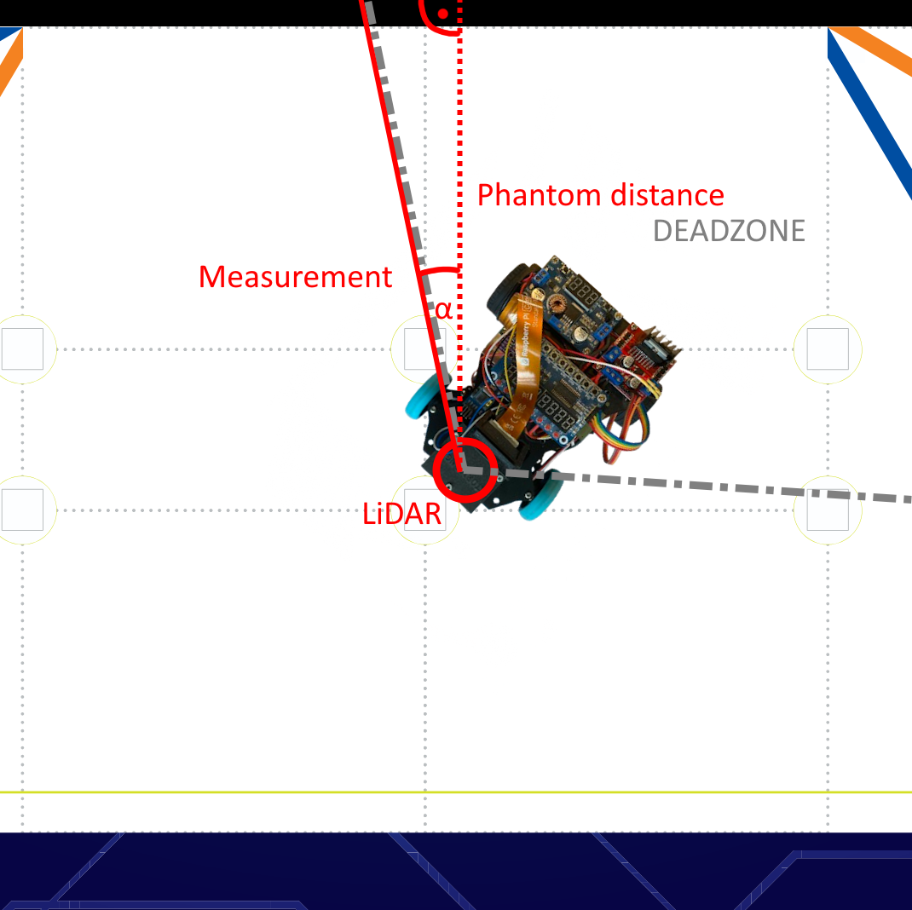
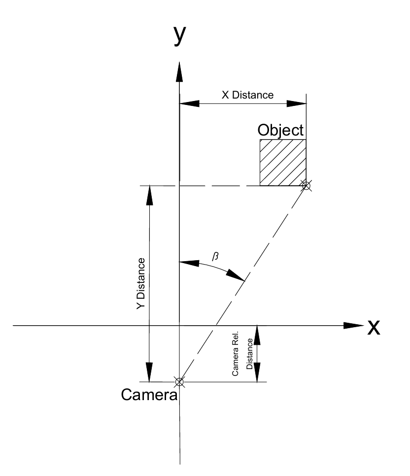
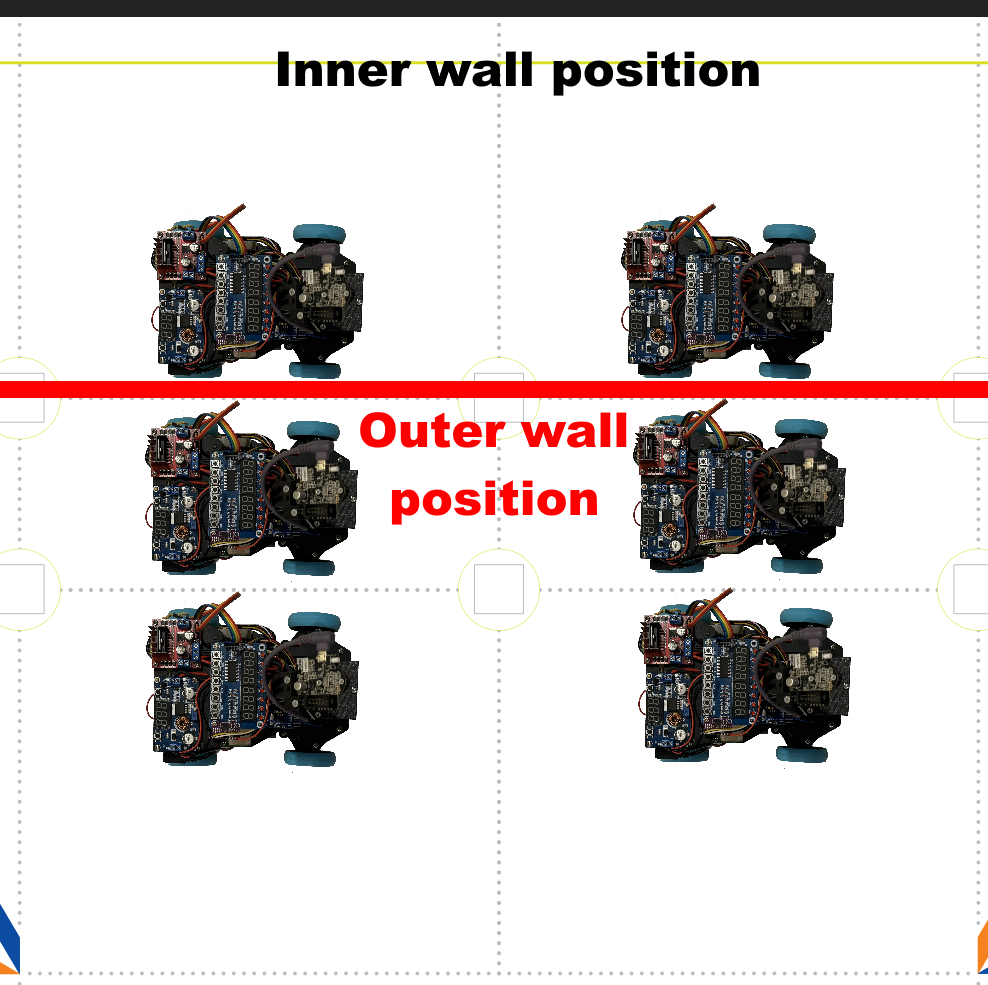
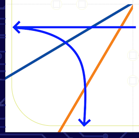

# Software documentation
This document serves to showcase all our different software solutions, that the ESP microcontroller and the Raspberry Pi serve as the basis of.
The Pi serves as the brain of the robot while the ESP is mostly responsible for low-level tasks. The base of our code is our framework, which runs on both platforms, written in Python on the Pi and in C++ on the ESP. It handles communication with different sensors, sometimes even byte-by-byte packet handling. It has a lot of movement, sensing, and high-level functions. When solving the open and obstacle challenge we applied one of our core principles, simplicity and broke both challenges down to their simplest forms.

This document also includes a software setup guide, detailing what libraries and environments we used and how to install them.
## Sensors and motors
The different communication protocols and libraries used between the components of the robot and their hierarchy:
- Computer
  - Raspberry Pi `SSH` **custom VScode extension**
    - ESP `UART` **custom serial protocol**
      - IMU `UART-RVC` **Adafruit_BNO08x_RVC library**
      - Motor encoder `Digital`
      - Motor driver `PWM` 2x`Digital`
      - Servo `PWM`
      - LiDAR (control) `PWM`
    - LiDAR (receive) `UART` **custom protocol implementation**
    - Led&Key panel `Data, Strobe, Clock` **TMBoard library**
    - Buzzer `Digital`
    - Camera `FPC Camera Cable` **picamera library**

Communication between the Raspberry Pi and the computer is handled by our custom-made Visual Studio Code extension, RpiCode. It creates the SSH connection over WiFi or Ethernet and enables us to upload or download files and even view live sensor data. More information about the extension can be found in the [RpiCode documentation](/other/RpiCode/README.md).

We use a plethora of different sensors and motors to make the robot go. For some of the sensors we simply used pre-made libraries for communication. This is usually the best decision as most of these libraries are made by the manufacturers themselves, who have the deepest understanding of the inner workings of the sensor. In other cases we had to write some simple code where most of the logic is setting pins to `HIGH` or `LOW` or detecting when pins change state. However in multiple cases for one reason or another we had to create our own solution. One of these cases is with the LiDAR sensor, as there were no Python libraries/solutions on the internet. We studied the [official developer documentation](https://www.elecrow.com/download/product/SLD06360F/LD19_Development%20Manual_V2.3.pdf) of the sensor, specifically the byte order in the serial communication. An image of that can be seen here: 
Our solution was to read the incoming data byte-by-byte and store every byte in an array until a full packet is received. The start of a packet is marked by the Header byte and since the packet byte-size is fixed, we read that many bytes. After this the packet is processed all at once. The sensor operates at 5000Hz and sends 12 measurements per packet, so it sends roughly 417 packets per second. Most numbers are in a two byte format, so we had to shift `M`ost `S`ignificant `B`yte then add the `L`east `S`ignificant `B`yte to get the full number. This part of the code can be found in [src/RaspberryPi/LidarService.py](/src/RaspberryPi/LidarService.py).
We also had to speed up the sensor to its maximum velocity, enabling us to receive measurements for every degree up to 15 times a second instead of 10, which was necessary to keep up with the high speed movement of the robot. This was done by sending a specific `PWM` signal from the ESP at a specific frequency. This proved challenging due to poor and lackluster documentation, our solution can be found in [src/ESP/run.ino](/src/ESP/run.ino) in the setup function.
However to receive 360 degrees worth of data 15 times a second would be 5400 measurements/sec, but the LiDAR only operates at 5000 Hz. This meant we wouldn't get measurement data for every degree. We solved this by detecting "gaps" and filling them with the measurement data of neighbouring degrees.

Another case where we had to create our own communication solution was between the ESP microcontroller and the Raspberry Pi. Initially we used `I2C` but it was unreliable so we switched to serial communication. We created our own protocol for two-way communication between the two devices. Since the ESP takes care of most sensor readings and the Pi needs up-to-date information we decided on a packet-based system where the ESP sends all sensor information 100 times a second. This packet is structured like this:
| isSynced | heading | encoderLeft | encoderRight | speed | vMode | sMode | logVar |
|---|---|---|---|---|---|---|---|
| 1 byte | 4 bytes | 4 bytes | 4 bytes | 4 bytes | 1 byte | 1 byte | 4 bytes |
| Is the ESP synced with the Pi | IMU heading angle | -EMPTY- since we have no left motor, legacy value | Right motor encoder position | Speed of the motors in encoder ticks/second | Velocity Mode, describes the current state of the motors such as forward, braking or unregulated | Steering mode, can be IMU-controlled, arcing or free | Log variable, used for debugging |

Since the ESP also controls the motors the Raspberry Pi needs to be able to send commands. These commands can be sent anytime, but they also follow a structure:
| CMD | params |
|---|---|
| 1 byte command identifier value | 3 byte command parameter |

We used little-endian to determine the order of the bytes. An example command to set the target speed (command identifier bytecode `0A`) to 1000 (in hexadecimal `E8` `03`) would look like this:

| 1. | 2. | 3. | 4. |
|:---:|:---:|:---:|:---:|
| `0A` | `E8` | `03` | `00` |

We use a 'heartbeat' system between the two units. The Raspberry Pi sends a heartbeat pulse every tenth of a second, and if the ESP doesn't receive this signal it stops all motors, resets the servo and updates its `isSynced` variable. This is a failsafe in case the Raspberry program crashes while the motors are on.

All of this code can be found in [src/RaspberryPi/ESP32_Service.py](/src/RaspberryPi/ESP32_Service.py) and [src/ESP/run.ino](/src/ESP/run.ino).

For the Led&Key panel we used a preexisting Python library that enabled us to set the display and the individual LEDs or check is a button is pressed.<br>Using the buzzer was also really simple, we just had to set the `+` pin to **HIGH** to start the sound and to **LOW** to stop it.

For the IMU we opted to use `UART-RVC` communication protocol, where RVC stands for Robot Vacuum Cleaner, since its most commonly used to help navigate robot vacuum cleaners. We choose this mode because this was the simplest one to implement, the sensor just sends the positional data 100 times a second. 

For the encoders we registered the **A** and **B** pins as interrupt pins, and counted how many times they go from **HIGH** to **LOW** or vice-versa, per second, and this would tell us the speed of the robot, with one detection being one "tick". How this translates to cm/s depends on the gear ratio of the motor, the ratio of the differential gear and of course the diameter of the wheels. In our case one centimeter equeals roughly 12.4 ticks. Our maximum speed is around 3200 ticks/second which comes out to roughly 260 cm/sec, or `2.6 m/s`. During the open challange we drive at around 2500 ticks/s or `2 m/s`, and for the more precise obstacle challange at around 800 ticks/second, `0.65 m/s`. We go as slow as 300 ticks/s, `0.24 m/s` during parking.

Steering with the servo is achieved by sending a `PWM` signal to the servo with the correct **dutycycle**. The same is true for the DC motor through the motor controller. More information about the mentioned libraries and how to install them can be found in the [software setup guide](#software-setup-guide).

For the camera we used the native `picamera` library with the Python opencv library `cv2` for accessing the camera feed and performing image analysis.
## The framework - basics
The Raspberry Pi and the ESP microcontroller work together, the ESP mostly completing commands sent by the Pi. The code on the ESP is running constantly, and is made up of two core components: a Main Loop and a Timer Interrupt that uses the hardware clock on the ESP microcontroller to run exactly 100 times a second. The Main Loop is responsible for reading sensors, such as the IMU sensor and doing simple calculations such as automatic IMU angle counting which entails detecting when the IMU angle would loop over from 360° to 0° and adding 360° to the count. It is also sending data packets to the Raspberry Pi and receiving and executing commands.
<br>The Timer interrupt handles speed regulation and steering, both using `PID` regulation, taking into account the current `vMode` and `sMode`. These modes define the steering and driving of the robot, both of which is controlled on the lowest level by the ESP. The Raspberry Pi only needs to send the relevant parameters over then set the `sMode` and `vMode`, and the rest is handled by the ESP. For example to drive straight the Pi needs to send over the target speed, target angle then set `vMode` to `VMODE_FORWARD`, `sMode` to `SMODE_GYRO`, so the speed and direction keeping is handled by the ESP.

To ensure accurate arcing (handled on the ESP) we had to compensate for the speed of the servo. Since our servo takes a considerate amount of time to turn from the outermost position to the centre (~0.2 seconds) waiting until the target angle is reached and then turning straight is not correct, as during this ~0.2 second the robot continues turning, missing the target angle. To combat this we introduced a `predictedYaw` variable which linearly interpolates based on the past gyro measurements 0.2 seconds into the future, which we use to stop when it reaches the target angle. This, of course, is far from a perfectly simulated calculation but we were able to fine-tune the parameters for our use case with great results.

On the Pi side there are 3 important processes. There is the main thread running the challenge code. This thread is usually blocked waiting for condition, such as going *x* centimeters, or until the robot is *x* centimeters from the wall. This thread can also send commands to the ESP. 

There is also a Communications process. This process is responsible for receiving data from the ESP and the LiDAR and process said data, storing it in easy to access variables and arrays. It is also responsible for sending heartbeat signals and handling Pi-side acceleration. Since multiple threads may communicate with the ESP we used a [Lock system](https://en.wikipedia.org/wiki/Lock_(computer_science)) which ensured that the two threads don't try to send commands to the ESP at the same time and end up mixing the byte order. This process also receives and processes data from the LiDAR sensor. It is really important that this thread doesn't get blocked since then we would't have up-to-date data, and the two devices might even fall out of sync. This is why we created the third process, the log thread.

This thread is responsible for writing all log data into files about 10 times a second so that later we can "rewatch" the robot run using the RpiCode tool, this is further explained in the [RpiCode documentation](/other/RpiCode/README.md). This includes log messages, current angle of the robot but also the current view of the LiDAR 10 times a second. The logs also contain every "LiDAR operation" conducted in that 1/15 second, such as checking the distance in an angle using `readLidar` or using `findNearestPoint`. We found that this many file operations can sometimes cause delay, however this thread intentionally doesn't do anything critical, in the worst case we will receive log messages a little later.

Finally, we run image analysis on a seperate **core**, so this way the resource intensive processing doesn't interfere with the regular operation of the robot and more time-sensitive operations.
## Framework - functions
We knew we wanted a really simple yet reliable framework as we found during our previous competitions in robomission that a good framework is extremely important. It can both make writing challenge code easier and trivialize implementing small rule changes each year.

The framework is made up of movement, sensing and high-level functions.
### Movement-related functions:
For movement we have an absolute-angle-system, which means that instead of turning 90° degree we turn **to** 90°, which will always be **right**.

`go(speed, direction)`<br>
The most important movement function, it starts the motors, tells the ESP the target speed and direction (absolute). After sending the commands the function returns. It's non-blocking and takes negligible time to run.

`goUnreg(force, direction)`<br>
Tells the ESP to start the motors with constant `force` instead of using the PID speed control algorithm, and `direction` (absolute).

`waitCM(cm)`<br>
Blocks execution until the robot has traveled `cm` centimeters, using the encoder data. If `cm` is negative it waits until the robot has traveled `cm` centimeters backwards.

`waitLidar(angle, cm)`<br>
Blocks execution until the LiDAR sensor reads a smaller value than `cm` in `angle`.

`waitAbsLidar(angle, cm)`<br>
Same as waitLidar except factors in the IMU sensor degree to achieve absolute angles. For example `0°` is always the front wall and `90°` is the right wall regardless of actual robot rotation.

`stop(brakeForce, wait)`<br>
Tells the ESP to start braking with a default braking force unless `brakeForce` (0-100) is specified. If `wait` is true it also waits until the robot is stationary before returning.

`arc(toDegree, speed, percent)`<br>
The robot arcs until it reaches `toDegree` (absolute) with `speed`. Percent means how much the wheels are turned during arcing. 100 means turned the maximum amount. It blocks execution until the target degree is reached, then switches to going straight and returns.

`setLane(wallDirection, targetDistance)`<br>
Moves the robot `targetDistance` centimeters away from the wall in the specified direction. This could mean moving closer or further away from the wall. The movement consists of going toward the wall (or away) until target cm is reached, then arcing straight. Since while arcing the robot's distance from the wall changes, we implemented some calculations which are added to the target distance.

For example, completing a 1 meter square (with rounded corners) would look like this:
```python
go(1000,0)
waitCM(100)
arc(90,500,100)
go(1000,90)
waitCM(100)
arc(180,500,100)
go(1000,180)
waitCM(100)
arc(270,500,100)
go(1000,0)
waitCM(100)
stop()
```
### Sensing functions
`readLidar(angle)`<br>
Returns the distance measured by the LiDAR sensor at `angle` using the last stored measurement, in centimeters. Also handles LiDAR **deadzone** checking, since the sensor can't see all 360°, some are covered by the robot's parts. Since its mostly used to measure wall distance this function can return so-called `phantom distances`. This means that instead of returning the faulty deadzone distance we measure the closest non-deadzone distance and using trigonometry calculate the distance for the original degree by assuming we are measuring the distance along a wall (so perpendicular to it):

The area between the gray lines is the zone where the LiDAR is blocked, the dotted red line is where we want to measure (perpendicular to the wall) and the solid red line is the first non-deadzone angle where we can measure distance. Alpha is the difference between the measuring angle and the requested angle. By imagining the right triangle defined by α, measured distance and phantom distance we can calculate the unknown length of phantom distance:
```python
phantom_distance=cos(α) * measured_distance
```

`readAbsLidar(angle)`<br>
Same as `readLidar` except it uses the IMU angle to calculate in absolute angles (the front wall is 0°, the wall to the right is 90° and so on).

`findNearestPoint(bottomLeftX, bottomLeftY, topRightX, topRightY)`<br>
Uses the LiDAR sensor to find the nearest detected object in the specified rectangle. The input coordinates are relative to the centre of the LiDAR. First, the rectangle's corner's `x`,`y` coordinates are mapped to a Polar coordinate system (to radius and angle from the origin). After this it checks the relevant angles, which are the angles between the bottom left corner's Polar angles and the top right corner's Polar angles. Then at all the relevant angles the angle and the LiDAR measurement (angle and radius) is converted back into `x` and `y` coordinates, relative to the center of the LiDAR sensor. After that, it checks if the converted point (x and y coordinate) is inside the rectangle defined by the parameters. If it is, then it gets stored. Finally it returns the closest stored point, which is the one with the lowest `y` value (relative to the center of the LiDAR). This function has two really important use cases. It can either be used, as the name implies, to find the nearest point and get its x and y coordinates relative to the robot. This is useful when going up to the traffic signs for example. The other use case is to simply check if there is an object in the selected rectangle or not, since if no objects were found it returns `-1`. This is used in many different places, for example in the beginning to check whether there is a traffic sign in front of the robot or not, and to check which direction the outer wall is.
This use case visualized in our [custom sensor data visualizer](/other/RpiCode/README.md):<br>

<br>(The white points are all what the LiDAR sees, the white lines are the "angles of interest", the red rectangles are where its checking for objects)

`findNearestPointAbs(bottomLeftX, bottomLeftY, topRightX, topRightY)`<br>
Same as `findNearestPoint` except it uses the bottom left corner of the current section on the mat as the origin point for the given coordinates (`bottomLeftX`, `bottomLeftY`,...) by measuring the distance to the left wall and to the back wall. If an object was found the detected point is returned also relative to the bottom left corner.

`findNearestObj(bottomLeftX, bottomLeftY, topRightX, topRightY)`<br>
Works similarly to `findNearestPoint` except it detects the start and end point of an obstacle (in our case a traffic sign). This data is represented by a `dataclass` with some key variables (starting point, endpoint) and some convenience methods such as calculating the centre of the object or checking whether the object was found or is `empty`. This data is crucial for detecting the color of the object.

`findNearestObjAbs(bottomLeftX, bottomLeftY, topRightX, topRightY)`<br>
Same as `findNearestObj` except it uses the gyro and the LiDAR to calculate the position relative to the bottom left corner of the current section, similarly to `findNearestPointAbs`.

`mapPointToCam(pointX, pointY, pointZ)`<br>
This function converts a point in 3D space, relative to the projection of the centre of the LiDAR on the mat to a pixel coordinate. After much thought we were able to reduce the problem to **two trigonometric functions**. First we calculate the X,Y,Z distance of the camera and the point using the known position of the camera. After this imagine the point of the camera and the given point viewed from above, and draw in the imaginary right triangle like so:<br>(X axis is sideways, Y axis is forward, example is detecting the top right point of a green traffic sign's front face)

Now do the same but viewed from the side:

(Z axis is up, Y axis is forward, example is detecting the top right point of a green traffic sign's front face)

Using the known distances we can calculate α and β, which specify how many degrees the point is away from the centre of the camera horizontally and vertically. After measuring the `FOV` of the camera, assuming a linear releation between degrees and pixels (the image is not distorted) and factoring in the vertical (and possible horizontal) rotation of the camera we can calculate the pixel location of the object on the camera image:
```python
x=(atan(Z_difference / Y_difference) + 0°) * (640 px / 53°)
y=(atan(X_difference / Y_difference) + 15°) / (480 px / 41.5°)
```
(The image is 640px*480px, horizontal FOV is 53°, vertical FOV is 41.5°, horizontal rotation is 0°, vertical rotation is 15°)

`detectObjectColor(Object obj)`<br>
Detects the color of the object by first calculating the pixel location of the top left point of the traffic sign and the bottom right point of the traffic sign gathered from the `Object` dataclass parameter. Then utilising multiprocessing uses `cv2.mean` to calculate the average of the selected area, plus we add a safety border of around 5 pixels. Finally we subtract the `green` value from the `red` value, and compares this number to a well-calibrated border value to determine whether the sign is red or green.

### High-level functions
These functions are more complex, mostly made up of other framework functions.

`initLoop()`<br>
Always called at the start of the program, initializes some variables, establishes connection with the ESP and other sensors, starts all processes and waits until the first button on the LedAndKey panel is pressed, after which it returns, and the robot run can start. While the button is not pressed it uses the LedAndKey's display to show useful sensor data. With the press of the second button you can cycle between different displays. The LEDs also display useful diagnostics information.

`switchLane(newLane)`<br>
Switches lanes to `newLane`, which can be the constant `LANE_LEFT` or `LANE_RIGHT`. After making some calculations, for example taking the parking lot into account it calls `setLane` with the correct parameters.

`correctWallDist(walldirection, targetDistance)`
Works similarly to `setLane` but moves at a very limited angle (10°) so arcing straight at the end won't affect the distance from the wall, enabling extra precise positioning. Designed for when the robot has to move straight for an entire section, so it has a lot of space for precise movements.

`turnCorner()`<br>
Turns the corner at the and of a section. It can turn two ways depending on the current lane of the robot on the end of the section (inner lane or outer lane).
## Robot run strategy
### Open challenge
In the open challenge the robot first determines the driving direction, then goes to the outer lane and completes 3 laps while staying on the outer lane the whole time.

The strategy of the placement of the robot inside the selected starting zone by us is the following: 
 
We try to have the robot near the center of the lane vertically, and somewhere in the middle horizontally.

At the start of the round the robot has to recognize the driving direction. This is done in multiple steps. First, the robot checks if it is directly next to a wall using the LiDAR sensor. This is only possible if the starting zone is one of the middle ones and the wall is on the outer position in the starting section, as can be seen on the previous illustration. If it is next to a wall that determines the driving direction for certain. If the wall is to the left of the robot then it will have to turn left at the corners and if it's to the right, then right. If a close wall was detected the robot will first move to the center of the available space by going at a 45° angle until the distance to the outer wall is half the available space (30 centimeters), then continue the round as normal.
```py
if close wall detected:
  if close wall is to the left then:
    driving direction = counter-clockwise
    go at angle 45°
  if close wall is to the right then:
    driving direction = clockwise
    go at angle -45°
  wait until distance from outer wall is 30 cm
  go at angle 0°
  
```
If there are no close walls the robot will decide the driving direction using the LiDAR. To make the measurements reliable it first goes forward, and then using the powerful `findNearestPointAbs` function checks which direction the open space is, and from this determines the driving direction.

After this both cases join, and the robot enters a simple loop which consists of going straight and arc-ing in the right, previously decided direction in the corners. The robot goes forward until the distance from the front wall is so a 90° arc will end in the next straight section's outer lane. Since the robot only drives in the outer lane the walls' randomization is effectively ignored, therefore reducing the possible scenarios we have to test, enabling us to test these few scenarios more, and in turn increases the run's constancy. After every turn we set an angle offset variable so that "forward" will always be 0°, this way the 4 straight sections and turns are exactly the same. This can be seen in the following pseudo-code segment:
```py
repeat 12 times:
  go
  wait until distance from front wall is 55 cm
  arc 90°
```
Finally after completing 3 laps the robot stops in the middle of the starting section.
```py
wait until distance from front wall is 150 cm
stop
```

### Obstacle challenge
In the obstacle challenge the robot completes straight sections independently of each other, going around traffic signs and avoiding the parking space. First it parks out, detects the driving direction similar to Open challenge, then in the first lap checks the color of the traffic signs. Finally after 3 laps it returns to the starting zone with the parking space, after which it parallel parks.

Simplification was our main principle when solving the obstacle challenge. First, we broke down the mat into 4 straight **sections** and four turns in the empty corner zones. We also broke down the straight sections into two main lanes, inner lane, which is the 40 cm wide inner space and outer space which is the outer 40 cm wide space. We also have a "middle lane", but that has no precise area, it's used to signal that the robot is neither in the inner nor the outer lane, for example in the start of each straight section after having turned. Our goal was to make only a handful of possible driving scenarios on the straight and corner zones. 

Start of the round the robot has to leave the parking space. This is a very precise operation so to eliminate slippage the robot moves at a **very** slow speed. Thankfully the robot can leave the parking space in one continous arc. However, depending on the traffic sign in front of the robot and the driving direction there are still 4 scenarios.<br>If the driving direction is counter-clockwise, the robot first arcs out so the traffic sign on the third row can be detected. Then the obstacle is avoided according to its color:

(If there is no traffic sign we treat it as if there were a red traffic sign)

If the driving direction is clockwise, then the robot will have to avoid the traffic sign on the middle row *or* the one on the last row. The robot moves into a position where it can detect the color of potential traffic signs on the second *and* third row. After this it avoids it according to its color:

(There can only be one traffic sign, either in the second or third row. There can also be no traffic sign there, which we treat as if a green traffic sign were there.)

On each straight section there could be 1 traffic sign on any row and any column or 2 traffic signs, one on the first row and one on the third row. This makes too many combinations, so we halved them by ignoring the column of the obstacle, always avoiding them as if they were occupying both spaces. At the start of each section we can check the color of the first traffic sign, note its location and switch to the correct lane. If the detected obstacle was on the first row, the robot also checks the third row in the middle of the section, and switches lanes if needed. This way there are only a few scenarios for each section.

   

So there really are only two movements we need to perfect, switching between two traffic signs and going straight. If the robot moves straight for the entire section (one obstacle or two obstacles of the same color) we call `correctWallDist` to combat gyro inaccuracy, since over 1 meter even 1° of error could result in considerable wall distance deviation.

If the current section is the one with the parking space (the starting section) we set a `wallOffset` variable to the outer wall, since there can't be any traffic signs on the outer lane here. When calling `switchLane` to move to the outer lane instead of moving to the regular distance from the wall we add this variable to it, thereby avoiding the parking space.

In the corner zones we simplified the movement to two possible scenarios, depending on the position of arrival to the zone. This can be on the inner lane or on the outer lane, depending on the color of the last traffic sign on the last straight section. To make straight and corner zones independent of each other both scenarios have to end on similar positions. This position was chosen to be about the center lane, so avoiding the first traffic sign will be about the same regardless of its color. In case the robot arrives from the outer lane it does a 90° arc then backs up to the wall. However since it could be arriving from a section with the parking space in it and due to this it could be much nearer the inner wall it won't have enough space for a full 90° turn. So instead it only does a 60° turn then while going back to the wall it straightens itself out. If the robot arrives from the outer lane then we don't have to worry about that. It goes near the front wall then does a backward arc, ending up at about the same position as the other scenario. The two scenarios:

 

After each turn we set an angle offset variable, same way as in Open Challenge, to ensure front is always 0°, right is 90° and so on.

After completing the first lap we no longer have to detect the color of the obstacles, which leaves the door open for further optimizations. We currently don't utilize these however, to ensure maximum reliability. 

After completing 3 laps, just before entering the starting section the robot starts the parking procedure. We again strived for simplicity and decided to develop **one** parking maneuver and fine tune it. If there is a traffic sign on the first row of the section it still has to avoid it in the correct direction. If according to the color the robot has to move to the outer lane, or there is no traffic sign there then the robot completes parking like so:

The robot comes from either the right or the left, depending on the driving direction, this is represented by the black arrows. Red arrows mean driving backwards, green means forwards. Accuracy is key during the maneuver so the robot moves very slowly and constantly senses its surroundings.
<br>However if the sign requires the robot to move in the inner lane we can't complete this unified parking maneuver. To make it work we have to avoid the sign by moving to the inner lane. Then we switch to the inner lane, and back up (making sure we don't pass the traffic sign in the wrong direction):

 After this we assume the unified parking position and complete parallel parking regularly.
## Software setup guide
This document serves as a guide for installing the necessary software and setting up environments on the programming computer, [Raspberry Pi 5](https://www.raspberrypi.com/products/raspberry-pi-5/) and [NodeMCU-32S](https://docs.ai-thinker.com/_media/esp32/docs/nodemcu-32s_product_specification.pdf) device. We tried to be as precise as possible when describing the steps, however if we did miss something let us know and we will try our best to help solve any problems. You can contact us at csabi@molnarnet.hu (Csaba) or andrasgraff@gmail.com (András).
### Programming computer
This can be either a laptop or a PC. We tested everything on a laptop running Windows 10, and one running Windows 11.
#### Python code editor
We used Visual Studio Code, but theoretically any code editor works. However we **strongly** recommend VScode, since the upcoming steps will be VScode-specific.
First you have to install [VScode](https://code.visualstudio.com/download). You will also need to download [Python 3.12](https://www.python.org/downloads/release/python-3120/). To connect the two finally you need to install the [Python extension](https://marketplace.visualstudio.com/items?itemName=ms-Python.Python) for VScode. Another extension we recommend downloading is [PyLance](https://marketplace.visualstudio.com/items?itemName=ms-python.vscode-pylance) which enables autocorrect for Python. To be able to download files to the Raspberry Pi you also need to install our custom-made extension **RpiCode**. This extension does way more than just upload files, for the installation process and full list of features, go to the **[other/RpiCode](/other/RpiCode/)** folder. Some libraries are Raspberry Pi **native**, so they aren't installed on the computer, the only nuisance this causes is the lack of autocomplete for those specific libraries. We simply chose to ignore this, however if you find autocomplete important you could "emulate" a library by creating a blank **.py** file with the function and class names of the missing native library, or look up how to install said library on windows.
#### Arduino IDE
The [Arduino Integrated Development Environment](https://www.arduino.cc/en/software) was our choice of software to develop on the **NodeMCU-32S** microcontroller. It's originally made for arduino microcontrollers, however it being **open source** allows manufacturers to develop custom board managers for their own microcontrollers. This is also the case with the NodeMCU-32S which is an **ESP32** microcontroller, so you will need to install the ESP boardmanager. For this we followed this tutorial ([https://www.aranacorp.com/en/programming-an-esp32-nodemcu-with-the-arduino-ide/](https://www.aranacorp.com/en/programming-an-esp32-nodemcu-with-the-arduino-ide/)). Now just make sure the attached libraries in the [src/ESP/libraries](ESP/libraries/) folder are next to the **run.ino** file in a libraries folder.
### Raspberry Pi 5
#### Setup
The Raspberry Pi 5 should have Raspberry Pi OS 64 bit downloaded. You need to create a folder that will be the destination of the file upload for the [RpiCode Extension](/other/RpiCode/README.md). You will need to install a few Python libraries using the **`pip`** tool. Pip most likely got installed along with Python but just in case it can be downloaded [here](https://pip.pypa.io/en/stable/installation/).
#### Installing libraries
- `pip install rpi-lgpio`
  - **GPIO** pin manager library for Raspberry Pi 5
- `pip install serial`
  - **Serial** communication library
- `pip install rpi-TM1638`
  - [TMBoard](https://thilaire.github.io/missionBoard/TM163x/) panel library
- `pip install picamera`
  - **Camera** module
- `pip install opencv-python`
  - **OpenCV 2** Python library
  
If you successfully install the libraries but still receive a module not found error try replacing the `pip` keyword with `pip3` or `pip3.12`.

There are some other libraries that don't need to be installed using `pip` because the source file is attached in the [src/RaspberryPi](RaspberryPi/) folder.

For the upload function of the extension to work the computer needs to be on the same WiFi as the Raspberry Pi. This can be achieved many different ways, we opted to use the Pi as a host and connect with the computer to the hotspot. Following the [official documentation](https://www.raspberrypi.com/documentation/computers/configuration.html#enable-hotspot) you have to type the following command into the terminal to start a hotspot:

`sudo nmcli device wifi hotspot ssid <example-network-name> password <example-password>`

To automatically start the hotspot every time the Pi boots up, you can append the command to the `rc.local` file which you can edit by typing `sudo nano /etc/rc.local` into the terminal.

The final thing to do is to enable program start on **boot**. This can be done in many different ways, here's a tutorial ([https://www.dexterindustries.com/howto/run-a-program-on-your-raspberry-pi-at-startup/](https://www.dexterindustries.com/howto/run-a-program-on-your-raspberry-pi-at-startup/)) we followed that explains 5 different methods.
### NodeMCU-32S
#### Connect
The microcontroller needs to be **connected** to the computer via a micro USB cable. If you followed the previously linked [NodeMCU tutorial](https://www.aranacorp.com/en/programming-an-esp32-nodemcu-with-the-arduino-ide/) correctly and after plugging the device in this message should appear in the bottom right corner:  
If this is the case then just pressing the **upload** button should start the code.

# Contact
If you have any further questions feel free to contact us at csabi@molnarnet.hu (Csaba) or andrasgraff@gmail.com (András).